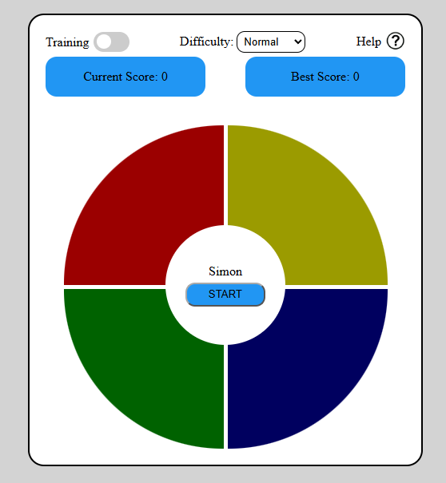

# Simon Says

_Simon is a game of memory, where the player memorizes the pattern shown using a disc with 4 different colored buttons, and then the player replays it as is._


---

## Getting Started

### Play The Game
[Deployed Game](https://hassanalsurh.github.io/Simon-the-game/)

[Planning Material](./plan/)

[Planning Material](https://github.com/HassanAlsurh/Simon-the-game/tree/16c5d046e5ed6714548917a75163da104d6fd42f/plan)


### How To Play
1. Load the deployed game
2. Press START
3. Press the buttons in the same sequenece that they light up
4. Press the ON button to pause
5. Press the OFF button to resume
6. If you lose or win, press RESTART to restart the game

### Installations
No Installation Required! simply clone the repo to your machine and open teh `index.html` file in your browser.

```bash
git clone
cd memory
open index.html
```

### Technologies Used
- HTML
- CSS
- JavaScript

### Assets Used
- [Simon buttons sounds](https://github.com/CForler-Git/Simon-Sounds/tree/master)
- [Win/Lose soundeffects](https://pixabay.com/)
- [Design and prototype](https://excalidraw.com/)
- [Fonts](https://fonts.google.com/)
- [JS logic](https://developer.mozilla.org/en-US/)
- [Image editing](https://www.pixelcut.ai/)

### Future Enhancements
1. Responsive design
2. Start page, including: 
   1. Play
   2. Settings
   3. Credits
3. Better UI
4. Arrow keys as a backup way to press teh buttons

### Credits
This project would've not been possible without the help and support of my instructor in GA, Ms. **Nabila** and the Instructor Associates, Ms. **Zainab** and Ms. **Bidoor**.